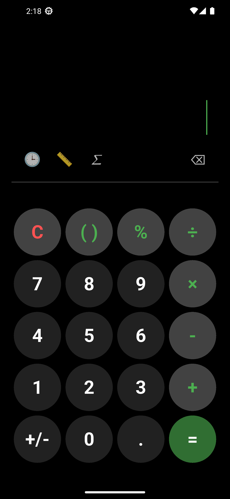
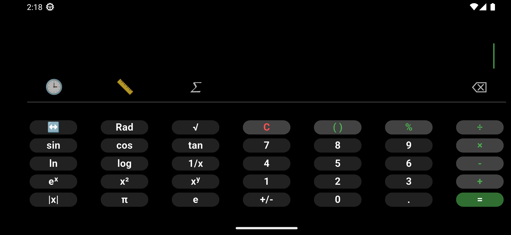

# 📱 Flutter Calculator App

A modern, responsive calculator app built using Flutter. It supports **both portrait and landscape modes**, featuring a **scientific calculator layout**. The UI is fully optimized for **different screen sizes** with **adaptive scaling**.

The project was developed with a focus on **responsiveness and seamless user experience** across devices. The app successfully performs **basic arithmetic calculations**, but **advanced scientific functions** (available in landscape mode) are not yet implemented. These can be added by extending the logic inside the `_onButtonPressed` function in the `main.dart` file.

The app has been tested on Android devices. Although, it should work on iOS and other platforms as well, they have not been officially tested.

## 🎯 Features

- ✅ **Fully responsive UI** (portrait & landscape)
- ✅ **Scientific calculator layout**
- ✅ **Custom styling with smooth animations**
- ✅ **Adaptive button sizes** for different screen sizes
- ✅ **Toggle between portrait & landscape mode** using the "𝛴" button
- ✅ **Dark mode inspired UI** for a sleek appearance

## 📸 Screenshots

### Portrait Mode:



### Landscape Mode:



## 🚀 Installation & Setup

1. **Clone the repository**:
   ```sh
   git clone https://github.com/yourusername/flutter-calculator.git
   ```
2. **Navigate into the project folder**:
   ```sh
   cd flutter_calculator_app
   ```
3. **Install dependencies**:
   ```sh
   flutter pub get
   ```
4. **Run the app on an emulator or device**:
   ```sh
   flutter run
   ```

> **Note:** Ensure you have Flutter installed. Check the official [Flutter Installation Guide](https://flutter.dev/docs/get-started/install) for setup instructions.

## 📌 Usage

- Tap **number buttons** to enter values.
- Use **scientific functions** in landscape mode.
- Tap **𝛴 button** to toggle between **portrait and landscape mode**.
- The app is **fully responsive** to screen sizes.

## 🔨 To-Do (Features that can be added)

- 🛠️ Implement the complete calculation logic
- 🎨 Improve animations
- 🖥️ Optimize the UI to cater for more types of devices
